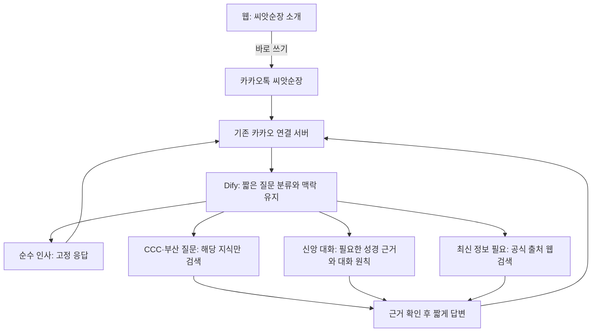

# 씨앗순장

씨앗순장을 소개하고 카카오톡 대화로 안내하는 웹사이트입니다.

- 상단: 기존 씨앗순장 캐릭터와 짧은 소개
- 하단: [카카오톡에서 바로 쓰기](https://pf.kakao.com/_xeHpxdX/chat)
- 공개 주소: https://ai.busanccc.com

## 실행과 검증

```bash
pnpm install
pnpm dev
pnpm check
pnpm build
```

홈은 정적으로 생성됩니다. 소개 페이지에는 Dify·Supabase 키가 필요하지 않습니다.
`NEXT_PUBLIC_SITE_URL`은 선택 사항이며 기본값은 `https://ai.busanccc.com`입니다.

로컬 서버 실행 후 전환 동작을 확인합니다.

```bash
node scripts/check-landing.mjs http://localhost:3000
```

## 웹 채팅 종료 동작

`src/proxy.ts`에서 이전 경로를 처리합니다.

- `/login`, `/onboarding`, `/auth/*`: 소개 페이지로 리다이렉트합니다.
- `/api/chat/*`, `/api/conversations`, `/api/messages`, `/api/auth/*`, `/api/profile/*`: HTTP 410과 카카오톡 링크를 반환합니다. 기존 Dify·Supabase 핸들러를 실행하지 않습니다.
- 홈에서 로그인·프로필 조회·대화 기록 조회·분석 이벤트·인앱 브라우저 토스트를 실행하지 않습니다.

기존 기능 코드는 전환 이력으로 남아 있습니다. 지식베이스, Dify 대화, Supabase 계정·프로필 데이터는 삭제하지 않습니다.
이 저장소에서는 카카오 챗봇 스킬 웹훅을 찾지 못했습니다. 카카오 OAuth 로그인은 챗봇 연동과 별개입니다.
**배포 전에 카카오 연결 서버가 이 웹의 종료 대상 API를 호출하지 않는지 실제 설정에서 확인해야 합니다.**

## 목표 구성 — Dify 개편은 별도 적용

웹 전환 코드는 구현했으며, 아래 Dify 분기와 데이터 정비는 제안 구성입니다.
기존 카카오 연결 서버의 위치·배포 설정은 이 저장소만으로 확인할 수 없습니다.



협업 규칙은 [CONTRIBUTING.md](./CONTRIBUTING.md)를 참고합니다.
